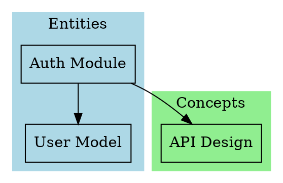

# Graph 索引优化设计文档

## 设计日期
2026-04-18

## 概述

为 oh-memory 插件优化 graph 实现，提供两类图索引：LLM 友好和人类友好，支持大型项目的高效处理。

## 设计目标

1. **LLM 友好**: 纯文本 Markdown 格式，便于 LLM 读取和搜索
2. **人类友好**: Graphviz DOT + HTML 可视化，支持交互和导出
3. **大型项目优化**: 分层索引、搜索过滤、缩放导航
4. **增量更新**: 智能检测变化，只更新受影响的部分
5. **固定元数据**: 统一的 frontmatter 结构，便于索引

## 架构设计

### 双轨图索引系统

#### 1. LLM 友好轨道

**格式**: 纯文本 Markdown

**核心文件**:
- `.memory/graph-index.md` - 主索引文件
- `.memory/graph-entities.md` - 实体分层索引
- `.memory/graph-concepts.md` - 概念分层索引
- `.memory/graph-sources.md` - 源文档分层索引
- `.memory/graph-synthesis.md` - 综合分析分层索引

**特点**:
- 结构化的节点列表（按类型分组）
- 明确的链接关系（使用 `[[链接]]` 格式）
- 丰富的元数据（标签、描述、更新时间）
- 支持全文搜索和快速定位

**大型项目优化**:
- **主索引文件**: 提供知识库的全局视图
  - 统计概览（节点总数、边总数、各类型数量）
  - 顶层分类（按模块/目录分组）
  - 重要节点列表（高度连接的节点）
  - 最近更新的节点

- **分层索引文件**: 
  - 按类型分层（entities, concepts, sources, synthesis）
  - 按模块分层（auth, api, database, etc.）

- **智能摘要机制**:
  - 节点摘要：简短描述和关键标签
  - 连接摘要：入链和出链数量，而非完整列表
  - 上下文窗口优化：先读主索引，再深入特定分层

**示例结构**:
```markdown
# Knowledge Graph Index

## Overview
- Total Nodes: 150
- Total Edges: 320
- Last Updated: 2026-04-18

## Top Categories
- [[graph-entities|Entities (80 nodes)]]
- [[graph-concepts|Concepts (40 nodes)]]
- [[graph-sources|Sources (20 nodes)]]
- [[graph-synthesis|Synthesis (10 nodes)]]

## Hub Nodes (High Connectivity)
- [[auth-module]] - 15 connections
- [[user-model]] - 12 connections
- [[api-design]] - 10 connections

## Recent Updates
- [[auth-module]] - Updated 2026-04-18
- [[user-model]] - Updated 2026-04-17
```

#### 2. 人类友好轨道

**格式**: Graphviz DOT + HTML

**核心文件**:
- `.memory/graph.dot` - DOT 源文件
- `.memory/graph.html` - 交互式可视化
- `.memory/graph-entities.dot` - 实体子图
- `.memory/graph-concepts.dot` - 概念子图
- `.memory/graph-module-*.dot` - 模块子图

**特点**:
- 支持分层展示（按模块、类型、目录）
- 支持搜索过滤和缩放导航
- 支持点击跳转到知识页面
- 适合大型项目的综合解决方案

**技术实现**:
- **Graphviz DOT**: 使用 Graphviz 语法，支持多种布局算法
- **交互式 HTML**: 
  - Viz.js (Graphviz 的 JavaScript 实现)
  - D3.js (可选，用于增强交互)
  
**功能**:
- 搜索过滤：输入关键词过滤节点
- 缩放导航：鼠标滚轮缩放，拖动平移
- 点击跳转：点击节点跳转到知识页面
- 分层切换：选择查看不同层次的图
- 导出功能：导出为 PNG/SVG

**大型项目优化**:
- **节点分组**: 使用 Graphviz 的 subgraph 功能，按模块/目录自动分组
- **渐进式渲染**: 初始只显示顶层节点，双击展开子图
- **性能优化**: 使用 SVG 格式（矢量，可无限缩放），懒加载子图数据

**示例 DOT 结构**:


### 增量更新机制

**智能更新策略**:

**1. 变化检测**
- 文件哈希：计算每个文件的哈希值，检测内容变化
- 元数据追踪：记录文件的最后更新时间
- 依赖分析：分析文件间的依赖关系，确定影响范围

**2. 增量更新流程**
```
文件变化 → 计算哈希 → 检测变化 → 
分析影响范围 → 更新受影响的节点 → 
更新受影响的边 → 更新索引文件 → 
记录更新日志
```

**3. 更新范围控制**
- 节点级更新：只更新变化的节点
- 边级更新：只更新受影响的连接关系
- 索引级更新：只更新相关的索引文件

**4. 性能优化**
- 缓存机制：缓存已计算的图数据
- 批量处理：批量处理多个文件变化
- 延迟更新：短时间内多次变化合并处理

**5. 数据结构**
```typescript
interface GraphUpdatePlan {
  addedNodes: string[]      // 新增的节点
  updatedNodes: string[]    // 更新的节点
  deletedNodes: string[]    // 删除的节点
  addedEdges: string[]      // 新增的边
  deletedEdges: string[]    // 删除的边
  affectedLayers: string[]  // 受影响的分层
}
```

**6. 更新触发条件**
- 文件内容变化（哈希不同）
- 文件新增或删除
- 元数据变化（标签、描述等）
- 用户手动触发更新

**7. 更新日志** (`.memory/graph-update.log`)
```
[2026-04-18 10:30:15] Incremental update
- Updated nodes: auth-module, user-model
- Added edges: auth-module -> api-design
- Updated layers: entities, concepts
- Duration: 150ms
```

### 固定元数据结构

**统一的 Frontmatter 结构**:

**1. 必需字段**
```yaml
---
id: auth-module                    # 唯一标识符
title: Authentication Module       # 标题
type: entity                       # 类型
date: 2026-04-18                   # 创建日期
updated: 2026-04-18               # 更新日期
---
```

**2. 索引相关字段**
```yaml
---
# 连接统计
connections:
  inbound: 15                      # 入链数量
  outbound: 8                      # 出链数量
  total: 23                        # 总连接数

# 分类信息
category: authentication           # 分类
module: auth                       # 所属模块
layer: core                        # 层级

# 标签系统
tags:
  - authentication
  - security
  - middleware

# 重要性指标
importance: high                   # low, medium, high, critical

# 状态信息
status: active                     # active, deprecated, draft
---
```

**3. 源文件信息**
```yaml
---
source:
  path: src/auth/index.ts         # 源文件路径
  hash: abc123def456              # 文件哈希
  lastModified: 2026-04-18        # 最后修改时间
  lines: 250                      # 行数
  language: typescript            # 语言
---
```

**4. 关系信息**
```yaml
---
relations:
  dependsOn:                      # 依赖关系
    - user-model
    - database-connection
  usedBy:                         # 被使用关系
    - api-routes
    - middleware
  relatedTo:                      # 相关关系
    - session-management
    - token-service
---
```

**5. 内容摘要**
```yaml
---
summary:
  description: "Handles user authentication and authorization"
  keywords:
    - login
    - logout
    - token
    - session
  keyFunctions:
    - authenticate
    - authorize
    - validateToken
---
```

**完整示例**:
```yaml
---
id: auth-module
title: Authentication Module
type: entity
date: 2026-04-18
updated: 2026-04-18

connections:
  inbound: 15
  outbound: 8
  total: 23

category: authentication
module: auth
layer: core

tags:
  - authentication
  - security
  - middleware

importance: high
status: active

source:
  path: src/auth/index.ts
  hash: abc123def456
  lastModified: 2026-04-18
  lines: 250
  language: typescript

relations:
  dependsOn:
    - user-model
    - database-connection
  usedBy:
    - api-routes
    - middleware
  relatedTo:
    - session-management
    - token-service

summary:
  description: "Handles user authentication and authorization"
  keywords:
    - login
    - logout
    - token
    - session
  keyFunctions:
    - authenticate
    - authorize
    - validateToken
---
```

**6. 元数据验证**
- 使用 JSON Schema 验证格式
- 必需字段检查
- 类型验证
- 枚举值验证

## 文件结构

```
.memory/
├── graph-index.md              # LLM 友好主索引
├── graph-entities.md           # 实体分层索引
├── graph-concepts.md           # 概念分层索引
├── graph-sources.md            # 源文档分层索引
├── graph-synthesis.md          # 综合分析分层索引
├── graph.dot                   # Graphviz DOT 主文件
├── graph.html                  # 交互式 HTML 可视化
├── graph-entities.dot          # 实体子图
├── graph-concepts.dot          # 概念子图
├── graph-update.log            # 更新日志
└── graph-cache.json            # 图数据缓存
```

## 实施计划

### 阶段 1: 元数据结构 (1-2天)
1. 定义 TypeScript 类型
2. 创建 JSON Schema 验证
3. 更新 `ingestFiles` 生成完整元数据
4. 测试元数据生成

### 阶段 2: LLM 友好索引 (2-3天)
1. 实现主索引生成器
2. 实现分层索引生成器
3. 实现智能摘要机制
4. 测试大型项目性能

### 阶段 3: 人类友好索引 (2-3天)
1. 实现 DOT 文件生成器
2. 实现交互式 HTML 可视化
3. 实现分层子图生成
4. 测试可视化效果

### 阶段 4: 增量更新 (1-2天)
1. 实现变化检测机制
2. 实现增量更新逻辑
3. 实现更新日志
4. 测试更新性能

### 阶段 5: 集成测试 (1天)
1. 端到端测试
2. 性能测试
3. 文档更新

## 技术实现要点

### 1. 类型定义 (`src/types/graph.ts`)
```typescript
export interface GraphMetadata {
  id: string
  title: string
  type: PageType
  date: string
  updated: string
  connections: ConnectionStats
  category?: string
  module?: string
  layer?: string
  tags: string[]
  importance: Importance
  status: Status
  source: SourceInfo
  relations: Relations
  summary: ContentSummary
}

export interface ConnectionStats {
  inbound: number
  outbound: number
  total: number
}

export interface SourceInfo {
  path: string
  hash: string
  lastModified: string
  lines: number
  language: string
}

export interface Relations {
  dependsOn: string[]
  usedBy: string[]
  relatedTo: string[]
}

export interface ContentSummary {
  description: string
  keywords: string[]
  keyFunctions?: string[]
}

export type Importance = 'low' | 'medium' | 'high' | 'critical'
export type Status = 'active' | 'deprecated' | 'draft'
```

### 2. 索引生成器 (`src/core/graph-indexer.ts`)
- `generateMainIndex()` - 生成主索引
- `generateLayerIndex()` - 生成分层索引
- `generateDOTFile()` - 生成 DOT 文件
- `generateHTMLVisualization()` - 生成 HTML 可视化

### 3. 增量更新器 (`src/core/graph-updater.ts`)
- `detectChanges()` - 检测变化
- `calculateUpdatePlan()` - 计算更新计划
- `applyIncrementalUpdate()` - 应用增量更新

## 性能指标

### 大型项目测试目标
- 1000+ 节点的项目
- 主索引生成时间 < 1秒
- 分层索引生成时间 < 500ms
- 增量更新时间 < 200ms
- HTML 可视化加载时间 < 2秒

### 内存使用
- 缓存大小 < 10MB
- 峰值内存 < 100MB

## 兼容性

### 向后兼容
- 保留现有的 `graph.json` 和 `graph.html`
- 新增文件不影响现有功能
- 用户可以选择使用新功能

### 升级路径
- 现有项目可以重新运行 `/memory-ingest` 生成新的元数据
- 旧的图索引文件会被新的替代

## 总结

这个设计为 oh-memory 插件提供了完整的图索引解决方案：

✅ **LLM 友好** - 纯文本 Markdown，分层索引，智能摘要
✅ **人类友好** - Graphviz DOT + HTML，交互式可视化
✅ **大型项目优化** - 分层展示，搜索过滤，缩放导航
✅ **增量更新** - 智能检测变化，高效更新
✅ **固定元数据** - 统一结构，便于索引和查询

这个设计将大大提升 oh-memory 插件的图索引能力，使其能够高效处理大型项目的知识库。
